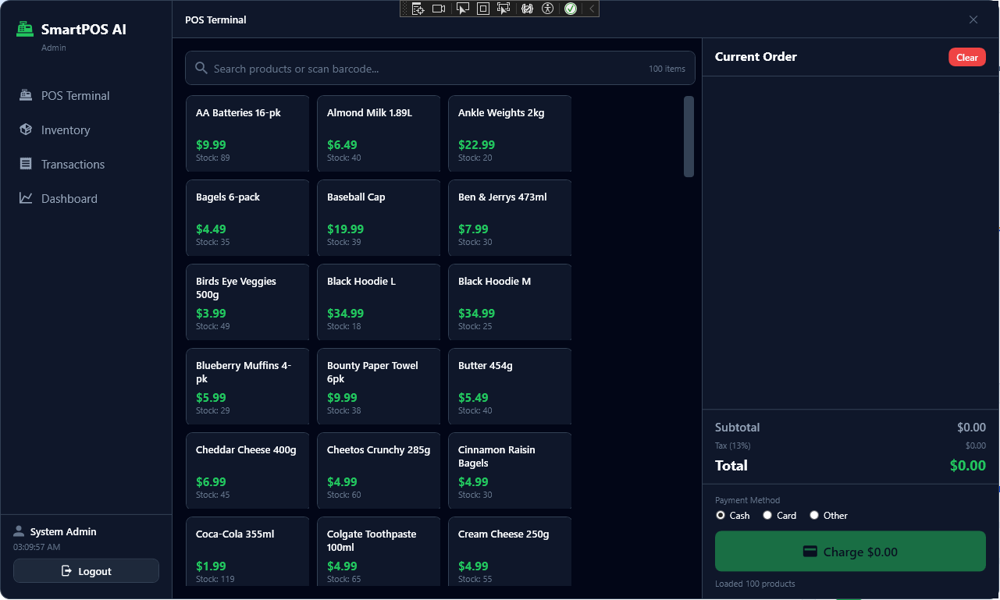
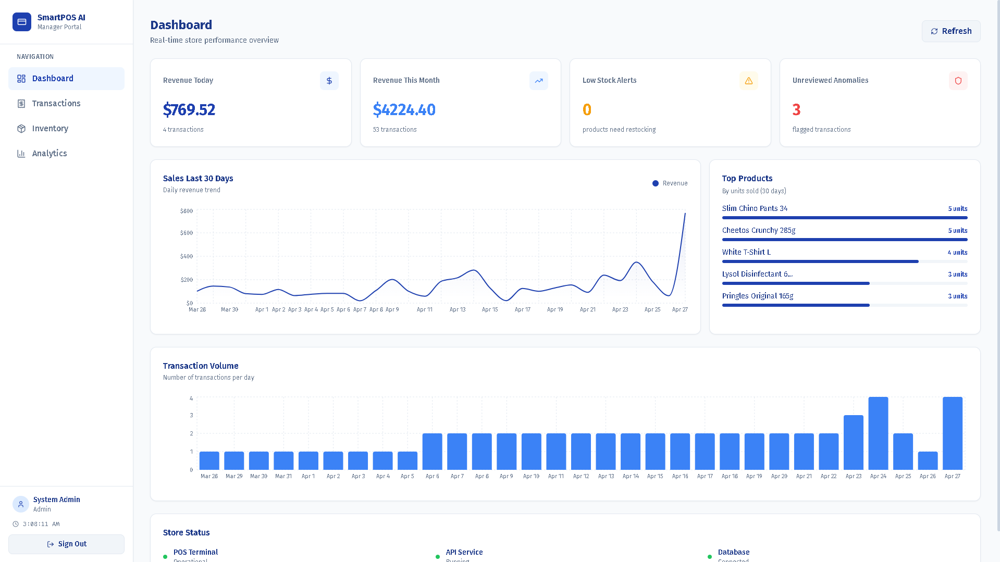
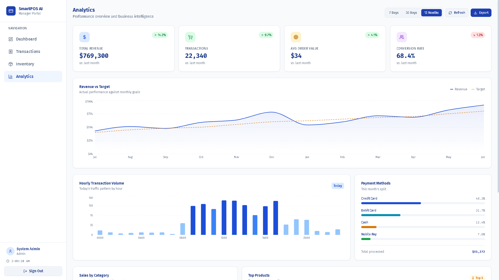
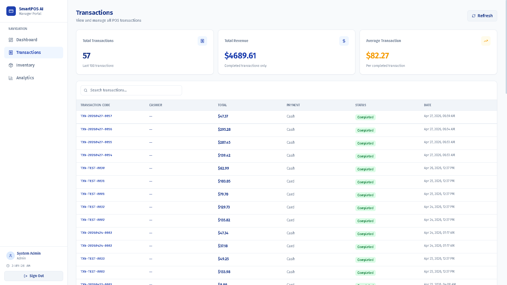
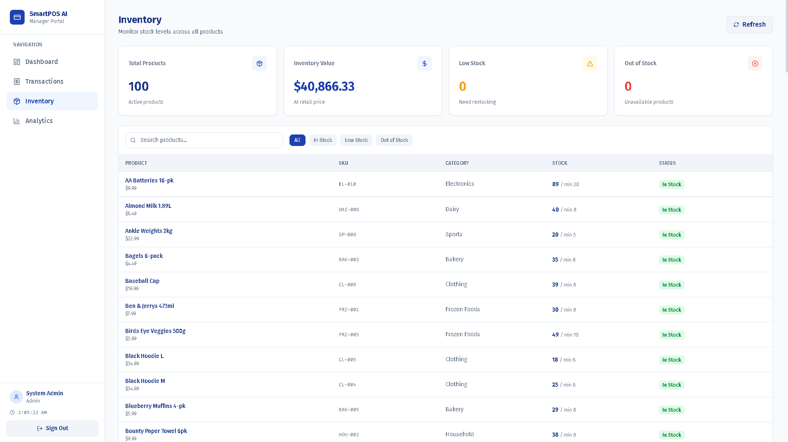

# SmartPOS AI

[](https://dotnet.microsoft.com)
[](https://learn.microsoft.com/en-us/dotnet/csharp/)
[](https://python.org)
[](https://react.dev)
[](https://www.microsoft.com/en-us/sql-server)
[](#license)

A hybrid, enterprise-grade Point of Sale system built with the same architecture used by Square, Lightspeed, and Toast — a C# WPF desktop app for cashiers, an ASP.NET Core Web API backend, a React manager dashboard, and Python AI microservices running sales forecasting, customer segmentation, and transaction anomaly detection.

---

## Demo

https://github.com/user-attachments/assets/0502bfbe-cd4b-40f0-a15f-aaa369ab067e

---

## Screenshots

### WPF Desktop — Cashier Terminal


### React Dashboard


### React Dashboard — Analytics


### React Dashboard — Transactions


### React Dashboard — Inventory


---

## Architecture

```
SmartPOS-AI/
├── src/
│   ├── SmartPOS.Core/            # Shared models, interfaces, enums, DTOs
│   ├── SmartPOS.Infrastructure/  # EF Core DbContext, repositories, migrations
│   ├── SmartPOS.API/             # ASP.NET Core Web API — controllers and services
│   └── SmartPOS.Desktop/         # C# WPF .NET 9 cashier terminal
├── SmartPOS.AI/                  # Python Flask microservice — AI features
│   ├── forecasting/              # Sales forecasting — scikit-learn / Prophet
│   ├── segmentation/             # Customer segmentation — K-Means clustering
│   └── anomaly/                  # Transaction anomaly detection — Isolation Forest
├── SmartPOS.Web/                 # React 18 + Vite manager dashboard
├── SmartPOS.Database/            # SQL Server schema, stored procedures, seed data
│   ├── schema/
│   ├── stored_procs/
│   └── seed/
└── SmartPOS-AI.sln
```

The WPF desktop app connects directly to SQL Server via Entity Framework Core for fast, offline-capable transaction processing. The ASP.NET Core API reads from the same database and exposes REST endpoints consumed by the React dashboard. Python AI microservices run as a separate Flask service on port 5100, called by the API — never directly by the client.

```
SQL Server (single source of truth)
    |
    +---> WPF Desktop App (EF Core — transactions, inventory, receipts)
    |
    +---> ASP.NET Core Web API (REST — analytics, auth, AI proxy)
              |
              +---> React Dashboard (manager portal)
              |
              +---> Python AI Microservice :5100
                        |-- /forecast
                        |-- /segmentation/run
                        |-- /anomaly/detect
```

---

## Features

### WPF Desktop — Cashier Terminal

- Product search with barcode-ready lookup
- Cart management — add, remove, adjust quantities
- Payment processing — cash, card, split payments
- Receipt generation — print or save as PDF
- Real-time inventory decrement on sale completion
- Role-based login — Cashier, Manager, Admin
- End-of-day summary report

### ASP.NET Core Web API

- JWT authentication with role-based authorization
- RESTful endpoints for transactions, inventory, customers, and analytics
- Service layer with full repository pattern — Controllers → Services → Repositories → DB
- Stored procedure integration for reporting queries
- AI proxy endpoints that call the Python microservice and return results
- CORS configured for the React dashboard

### Python AI Microservice (Flask — port 5100)

- **Sales Forecasting** — trained on historical transaction data using scikit-learn linear regression and Prophet, returns a 7 or 30-day revenue forecast
- **Customer Segmentation** — K-Means clustering on purchase frequency, recency, and average order value, assigns each customer a segment (New, Occasional, Regular, High Value, At Risk)
- **Transaction Anomaly Detection** — Isolation Forest model flags suspicious transactions by anomaly score, results written back to SQL Server
- `/health` endpoint for service availability checks
- Models persisted as `.pkl` files, retrain endpoints available

### React Manager Dashboard

- **Dashboard** — KPI cards (revenue, transactions, avg order, top category), recent transactions table, low stock alerts panel
- **Transactions** — searchable and filterable transaction history with status badges and detail drill-down
- **Inventory** — full product list with stock levels, low stock and out-of-stock filtering, restock indicators
- **Analytics** — revenue vs target area chart, hourly transaction volume heatmap, payment method breakdown, sales by category donut chart, top 5 products by revenue with trend badges, AI insight banner

### Database

- SQL Server with Entity Framework Core migrations
- Tables: Users, Products, Categories, Customers, Transactions, TransactionItems, InventoryLogs, CustomerSegments, AnomalyLogs
- Stored procedures for end-of-day reports, top product queries, and revenue aggregation
- Seed data for development and demo

---

## Tech Stack

| Layer | Technology |
|---|---|
| Desktop App | C# WPF, .NET 9 |
| Backend API | C# ASP.NET Core Web API, .NET 9 |
| ORM | Entity Framework Core 9 |
| Business Logic | Repository Pattern, Service Layer |
| Authentication | JWT Bearer tokens, BCrypt password hashing |
| AI Microservice | Python 3.11, Flask, scikit-learn, Prophet |
| Web Dashboard | React 18, Vite, Recharts, Tailwind CSS, Lucide |
| Database | SQL Server, T-SQL, Stored Procedures |
| AI Assistant | Claude API (Anthropic) |

---

## Prerequisites

- .NET 9 SDK
- Visual Studio 2022 (for WPF desktop development)
- SQL Server or SQL Server Express
- SQL Server Management Studio (SSMS)
- Python 3.11 (Anaconda recommended)
- Node.js 18+

---

## Setup

### 1. Clone the repository

```bash
git clone https://github.com/DoshiTirth/SmartPOS-AI.git
cd SmartPOS-AI
```

### 2. Database

Open SSMS, connect to your SQL Server instance, and run the scripts in order:

```
SmartPOS.Database/schema/     -- run all .sql files first
SmartPOS.Database/seed/       -- run seed data after schema
```

### 3. Configure connection strings

In `src/SmartPOS.API/appsettings.json` and `src/SmartPOS.Desktop/appsettings.json`, update:

```json
{
  "ConnectionStrings": {
    "DefaultConnection": "Server=YOUR_SERVER;Database=SmartPOSDb;Trusted_Connection=True;TrustServerCertificate=True;"
  },
  "JwtSettings": {
    "Secret": "your-secret-key-here"
  }
}
```

### 4. Run the ASP.NET Core API

```bash
cd src/SmartPOS.API
dotnet run
```

API runs on `https://localhost:7xxx` — check the console output for the exact port.

### 5. Set up the Python AI microservice

```bash
conda create -n smartpos-ai python=3.11
conda activate smartpos-ai
cd SmartPOS.AI
pip install -r requirements.txt
```

Copy `.env.example` to `.env` and fill in your values:

```env
DB_SERVER=YOUR_SERVER
DB_NAME=SmartPOSDb
CLAUDE_API_KEY=your-claude-api-key
FLASK_PORT=5100
```

```bash
python app.py
```

Flask microservice runs on `http://localhost:5100`. Verify at `http://localhost:5100/health`.

### 6. Run the React dashboard

```bash
cd SmartPOS.Web
npm install
npm run dev
```

Dashboard runs on `http://localhost:5173`. Log in with the seeded manager credentials.

### 7. Run the WPF desktop app

Open `SmartPOS-AI.sln` in Visual Studio 2022, set `SmartPOS.Desktop` as the startup project, and press F5.

---

## Demo Credentials

| Role | Username | Password |
|---|---|---|
| Admin | admin | Admin@2024 |
| Manager | manager | Manager@2024 |
| Cashier | cashier | Cashier@2024 |

---

## API Endpoints

### Authentication

| Method | Endpoint | Description |
|---|---|---|
| POST | `/api/auth/login` | Returns JWT token |
| POST | `/api/auth/logout` | Invalidate session |

### Transactions

| Method | Endpoint | Description |
|---|---|---|
| GET | `/api/transactions` | All transactions (paginated) |
| GET | `/api/transactions/{id}` | Transaction detail |
| POST | `/api/transactions` | Create new transaction |
| PUT | `/api/transactions/{id}/void` | Void a transaction |

### Inventory

| Method | Endpoint | Description |
|---|---|---|
| GET | `/api/products` | All products |
| GET | `/api/products/{id}` | Product detail |
| POST | `/api/products` | Add product |
| PUT | `/api/products/{id}` | Update product |
| GET | `/api/inventory/low-stock` | Products below threshold |

### AI (proxied to Python microservice)

| Method | Endpoint | Description |
|---|---|---|
| GET | `/api/ai/forecast?days=7` | Revenue forecast |
| POST | `/api/ai/segmentation/run` | Run customer segmentation |
| POST | `/api/ai/anomaly/detect` | Run anomaly detection |

---

## Branch Strategy

```
main                    -- stable, production-ready
feature/database        -- schema and EF Core migrations
feature/api             -- ASP.NET Core API layer
feature/desktop         -- WPF cashier terminal
feature/ai-services     -- Python microservice
feature/react-dashboard -- React manager portal
```

---

## License

Copyright (c) 2026 Tirth Doshi. All rights reserved.

This software and its source code are the intellectual property of Tirth Doshi. No part of this software may be reproduced, distributed, modified, or used in any form without explicit written permission from the author.

